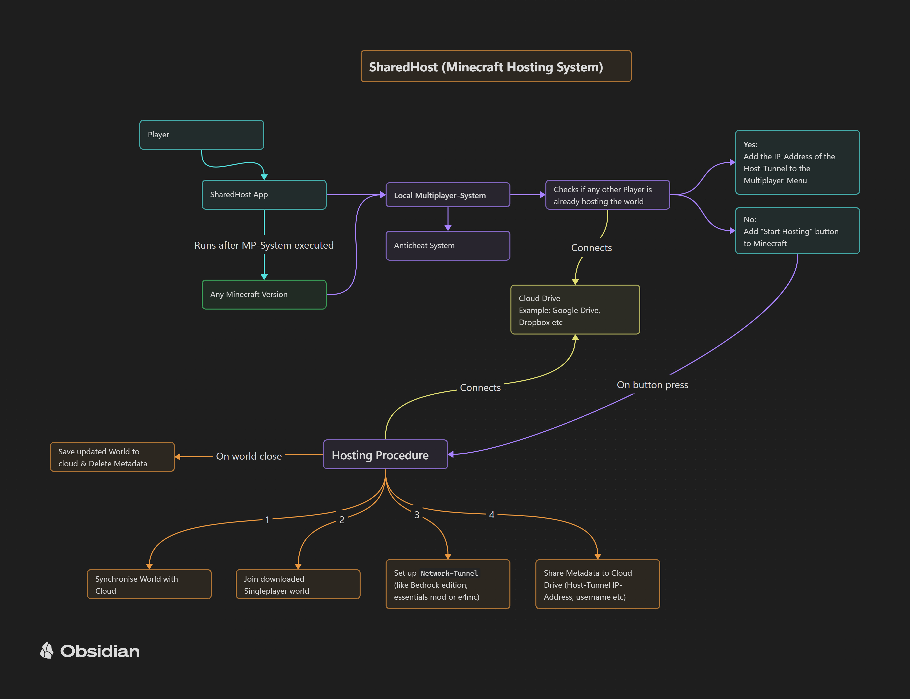

# SharedHost ☁️⚡  

A minimal, zero-configuration Minecraft hosting system where **one player acts as the active host** — without any server setup, port forwarding, or networking knowledge required.

SharedHost is not a cloud server and not simple world-syncing.  
Instead, **the game itself turns the active player into the host**, and all other players connect through the SharedHost launcher. Only one player can host at a time, keeping the experience simple, stable, and easy to understand.

---

## 🌟 Key Features

- **Single Active Host System**  
  Exactly one player hosts the game at any given moment. No dedicated server required.

- **Automatic World & Data Sync**  
  When hosting switches between players, SharedHost synchronizes all relevant data so everyone always has the correct world state.

- **Zero Network Configuration**  
  No port forwarding, no firewall rules, no DNS, no server setup.  
  The launcher handles all connection logic behind the scenes.

- **Instant Join Through the Launcher**  
  Other players connect directly to the active host with one click — no IPs, no ports.

- **Lightweight Essentials-Like Tools**  
  Basic utilities and quality-of-life features without heavy modification.

- **Secure by Design**  
  No exposed ports. All communication is encapsulated safely through the launcher.

---

## 🚀 How It Works

1. **A player starts the launcher and becomes the host**  
   Their device runs the world and acts as the temporary server.

2. **Other players use the launcher to join this host**  
   They connect automatically — no manual setup required.

3. **Hosting can change at any time**  
   SharedHost syncs the world so another player can take over seamlessly.

4. **Always one host, always one synchronized world**  
   Simple and predictable.

---

## 🛠 Tech Overview

- Custom Minecraft mod (sync layer + utilities)  
- Launcher (Electron/Node.js or Python variant)  
- Peer-to-peer host switching with automatic data transfer  
- No dedicated online server, no network configuration

---

## 📦 Installation

*(Pending first public launcher build.)*

1. Download the launcher  
2. Run it  
3. Press **Start Hosting** or **Join Game**  
4. Play immediately

---

## 🤝 Contributing

Issues and pull requests are welcome.  
Feel free to suggest ideas, improvements, or bug reports.

---

## 📄 License

To be added soon (likely MIT).

---

## ❤️ Why SharedHost?

Because not everyone wants to set up a server.  
SharedHost makes Minecraft co-op as simple as:  
**One host. One world. One click.**
